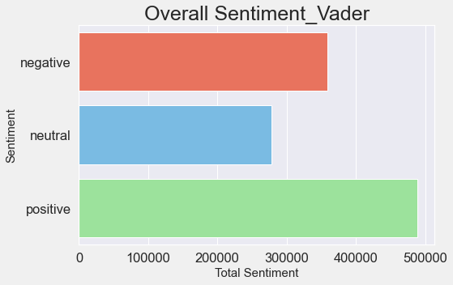
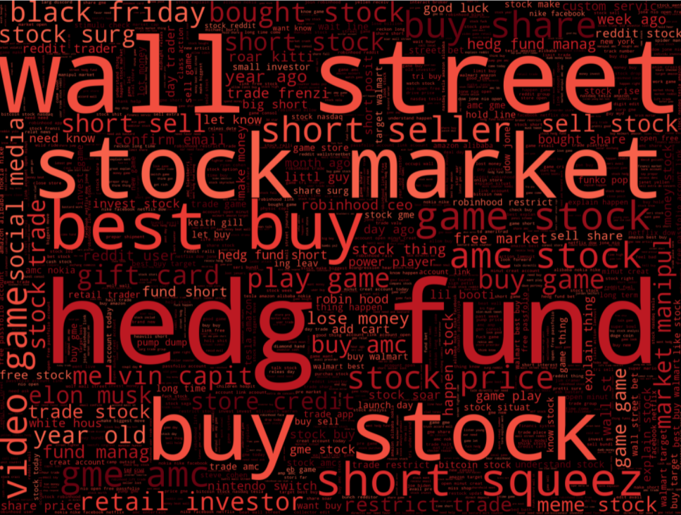

# Sentiment Analysis on 💎 GameStop 💎 Phenomenon

## Table of Contents
* [1. Introduction](#1-introduction-1)
* [2. Data Collection](#2-data-collection-1)
* [3. Exploratory Data Analysis](#3-exploratory-data-analysis-1)
* [3.1. '$GME' Stock Price Evolution from September 2020 to April 2021](#31-gme-stock-price-evolution-from-september-2020-to-april-2021-1)
* [3.2. Exploratory Data Analysis from Twitter](#32-exploratory-data-analysis-from-twitter-1)
* [3.3. Compare Twitter vs Stock Price](#33-compare-twitter-vs-stock-price-1)
* [4. Modelling](#4-modelling-1)
* [4.1. Predicting if the Stock Goes Up or Down](#41-predicting-if-the-stock-goes-up-or-down-1)
* [4.2. Predicting How Many Replies a Quoted Tweet Will Have](#42-predicting-how-many-replies-a-quoted-tweet-will-have-1)
* [5. Findings](#5-findings-1)
* [6. Next Steps](#6-next-steps-1)

## 1. Introduction

Investing and Trading apps opened the door to retail investment, democratising wealth generation through investing in stocks and bonds. Retail traders account for almost 20% of the stock market's activity nowadays. The growing proportion of options traders reflect the retail investors knowledge and what they share in social media. Even though they represent such a small percentage, they could influence the price of the stock "GameStop'' represented by the ticker $GME in February 2021.
A small community on the Reddit platform, denominated by WallStreetBets, initiated a movement to save the video game retailer GameStop. Motivated by childhood memories and even some sense of justice about the 2008 financial crisis, they decided to save the company that wall street hedge funds were shorting.  
The phenomenon spread across social media, including Twitter, the most used social platform. To understand if there is an influence from social media on the stock price it is necessary to first prove that the stock price did not follow a standard pattern and then cross-reference with information that was extracted from Twitter.
In this project, sentiment analysis was used to find a correlation between stock price and the GME stocks tweets, and its evolution through time. The time period used for this analysis ran from September 2020 till April 2021.

## 2. Data Collection

The data was collected from Twitter and Yahoo finance from September 2020 to April 2021. A total of 1,434,034 tweets were collected based on the word 'GameStop'. Also collected was the stock price which was tracked hourly.

Features collected from Twitter:

Features collected from Yahoo:

## 3. Exploratory Data Analysis
### 3.1. '$GME' Stock Price Evolution from September 2020 to April 2021
The stock's price was studied based on the random walk principle that states that a stock price today is the best predictor for its price tomorrow. In the presence of unseen volatility, it could be assumed that external factors might influence the stock price.

•__Evolution of the stock price by month__
A brief observation of the stock price showed that the median of the close and open price of the GME stock had been increasing over time. However, the peak price was registered in January 2021, coincident with the month of higher stock volume transaction.

•__Autocorrelation and Partial Correlation__
The autocorrelation allows checking if the stock price at one point is correlated with the stock price of the point that's directly prior in time. The horizontal constant dashed line indicates a limit of the size of autocorrelations for being not just due to random effects. Because most of the values were inside the dashed boundary lines, the correlation was low.
Partial autocorrelation also did not show any pattern relevant to predicting the stock price.
Non-correlation of price over time indicated that we were in the presence of a momentum stock.

### 3.2. Exploratory Data Analysis from Twitter
•__Numerical Data__
The chart below presents the evolution of the number of tweets during the analysis period. It is visible that the peak occurred between January and February 2021.

Below are plotted the number of followers by username, verified status, most quoted users, most active users, users with the most liked tweets and users with the most replied tweets.
Interestingly, the users with more followers belong to organisations, such as Reuters, WSJ (Wall Street Journal) and New York Times. Between the most quoted and replied usernames was CNBC and Jim Cramer.

•__Text Data__
The text data was processed through a natural language processing pipeline to reduce the noise and improve the classifiers results, this was achieved through Spacy and Vader NLP packages. Below are the bar plots of the different sentiments obtained for each of the methods, respectively.

  

The word cloud below shows the most common combinations of words used on the tweets. Interesting to have combinations like 'buy stock', 'wall street', 'hedge funds'

  

### 3.3. Compare Twitter vs Stock Price
The chart below shows the evolution in the four different features: 'number of tweets', 'volume' of the stock, the stock price at  'close', stock price and 'Vader compound' that varies according to the sentiment score. The 'Vader compound' feature did not show any variation through time. Although, the number of tweets and stock volume or price had peaks occurring almost at the same time or within small intervals of difference.

  

## 4. Modelling
### 4.1. Predicting if the Stock Goes Up or Down
•__Choosing the algorithm__
The features extracted from the Twitter data frame were resampled by day and used to predict the target. The target was a binary variable calculated based on the 'close' and 'open' stock price feature. When 'open' was higher than 'close', the variable would take a value of '0' and '1' vice versa.
Based on supervised classification algorithms, the best model, chosen by the best cross-validation score, was used to predict the fluctuation price of the stock.
The algorithm with the best performance was a random forest classifier for entropy and a maximum depth of 3, with a cross-validation score of 0.81, a training set score of 0.87 and a test score of 0.79.

  

•__Confusion Matrix__
Below is the confusion matrix for training and test data. For training data, the predicted target had an accuracy of 0.87, recall of 0.93 and precision of 0.89. For the test set, the predicted target had an accuracy of 0.78, recall of 0.878 and precision of 0.824.

  

•__ROC Curves__
The ROC curve shows the trade-off between sensitivity (or TPR) and specificity (1-FPR). Curve close to the top-left corner indicates the good performance of the classifier, as we can see for the training set, on the other hand, the test set reveals a curve coming closer to the 45-degree diagonal of the ROC space, with less accuracy.

### 4.2. Predicting How Many Replies a Quoted Tweet Will Have
•__Choosing the algorithm__
Regression machine learning algorithms were used to predict how many replies a quoted tweet will have. The training and test data were selected from the original Twitter dataset, filtered by the quoted tweets. The target variable was 'reply_count', the number of replies.
Different models were trained and tuned, and the chosen one was the model with the best cross-validation score. The best-performed model was the bagging regressor with a cross-validation score of 0.49, a train score of 0.81 and a test score of 0.48.

•__Residuals__
As expected, due to the low cross-validation score, the residuals didn't follow the regression line, being concentrated mostly around zero.

## 5. Findings
* The price of the stock GME did not follow a specific pattern between September 2020 and April 2021;
* The correlation between sentiment analysis and stock price is low, which suggests that it is difficult to predict the evolution of the stock price based on it;
* Different NLP packages produce different results;
* The volume of tweets follow evolution in time similar to the stock price, which indicates that the content of tweets is not relevant, the stock only needs to be mentioned;
* Based on the Twitter Analysis, it was possible  to predict with 81% of confidence if the stock price was going up or down;
* The prediction of how many replies a twitter post will have is difficult.

## 6. Next Steps
* The same study should be extended to different commodities to understand if the ‘rumour’ influence the price of the stock or if all the market is going through a similar phase and its perhaps connected to the global economy;
* The company earnings growth, market capital, annual earnings and general performance should be taken into consideration;
* News articles from financial newspapers and also from Reddit channels should be analysed;
* Creation of an algorithm that can detect in early stages unusual mentions to stock and stocks tickets.
